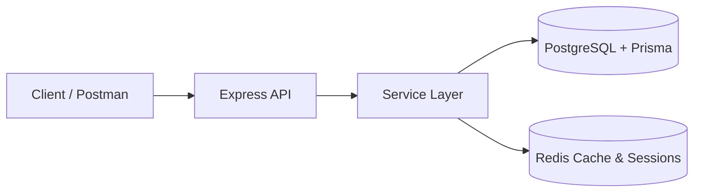

# TeamFlow API

A multi-tenant SaaS backend for team and task management — think a lightweight Jira/Notion, built from scratch with a clean architecture in mind.

## Overview

I built this portfolio project to explore a REST API with per-company data isolation, JWT authentication with token rotation, dynamic role-based access control, and Redis caching. It is a local demonstration, with no production customers or measured production scale.

## Architecture



A few key decisions I made here:

- **Multi-tenant isolation** — business entities carry a `tenantId`, and query filters use it to scope access. Broader cross-tenant testing is still needed before claiming complete isolation.
- **Session cache** — refresh sessions are stored and validated in Redis, not just the database, for fast revocation.
- **Query cache** — project and task list responses are cached in Redis with prefix-based invalidation on writes.

## Tech Stack

- **Runtime**: Node.js + TypeScript
- **Framework**: Express
- **ORM / DB**: Prisma + PostgreSQL
- **Cache**: Redis (ioredis)
- **Auth**: JWT (access + refresh) + bcryptjs
- **Testing**: Jest + Supertest
- **Infrastructure**: Docker + Docker Compose

## How to Run

```bash
# 1. Set environment variables
cp .env.example .env

# 2. Start the full stack (API + PostgreSQL + Redis)
docker compose up --build

# 3. Seed the database with a default tenant and admin user
docker compose exec api npm run prisma:seed

# 4. Verify the API is up
GET http://localhost:4000/health
```

## API Reference

### Auth
| Method | Endpoint | Description |
|--------|----------|-------------|
| `POST` | `/api/auth/register-tenant` | Register a new company + admin user |
| `POST` | `/api/auth/login` | Login and receive access + refresh tokens |
| `POST` | `/api/auth/refresh` | Rotate refresh token |
| `POST` | `/api/auth/logout` | Revoke refresh session |

### Projects `(requires auth)`
| Method | Endpoint | Required Permission |
|--------|----------|---------------------|
| `GET` | `/api/projects` | `projects.read` |
| `POST` | `/api/projects` | `projects.write` |
| `DELETE` | `/api/projects/:projectId` | `projects.write` |

### Tasks `(requires auth)`
| Method | Endpoint | Required Permission |
|--------|----------|---------------------|
| `GET` | `/api/tasks?projectId=<id>` | `tasks.read` |
| `POST` | `/api/tasks` | `tasks.write` |
| `PATCH` | `/api/tasks/:taskId/status` | `tasks.write` |

### RBAC Admin `(requires auth)`
| Method | Endpoint | Required Permission |
|--------|----------|---------------------|
| `GET` | `/api/admin/permissions` | `permissions.manage` |
| `POST` | `/api/admin/permissions` | `permissions.manage` |
| `DELETE` | `/api/admin/permissions` | `permissions.manage` |

## Security Model

I implemented a layered security approach:

- **Short-lived access tokens** — expire in 15 minutes (`JWT_ACCESS_EXPIRES_IN`)
- **Long-lived refresh tokens** — expire in 7 days (`JWT_REFRESH_EXPIRES_IN`), stored as SHA-256 hashes in the database
- **Redis session store** — refresh sessions are also cached in Redis for fast lookups and instant revocation
- **Middleware chain** — every protected route goes through `authMiddleware` → `tenantMiddleware` → `requirePermission(key)`

## Design Decisions

**Tenant-first data model** — I decided to embed `tenantId` directly in every entity rather than using separate schemas. It keeps the queries straightforward and works well with Prisma.

**Dynamic permissions** — Instead of hardcoding role permissions, I store them in a `RolePermission` table per tenant. This means an admin can grant or revoke any permission at runtime without a deploy.

**Redis as a first-class citizen** — I cache both query results and permission lookups in Redis, with different TTLs. Writes always invalidate the relevant keys using a prefix scan, so data is never stale.

**No magic, just middleware** — auth, tenant isolation and permission checks are all independent middlewares composed together in the route definitions. Easy to test, easy to reason about.

## Tests

I wrote three test suites covering the main reliability concerns:

```bash
npm test
```

- `tests/unit.test.ts` — utility functions (time math, token helpers)
- `tests/auth.test.ts` — input validation and unauthenticated access
- `tests/roles.test.ts` — permission middleware allow/deny logic
ners running

## Future Improvements

- OpenAPI / Swagger documentation
- Rate limiting per tenant
- Audit log (track who changed which permissions and when)
- Background job queue
- Next.js frontend dashboard
